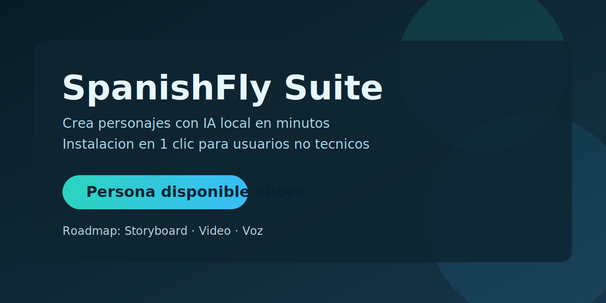

# SpanishFly Suite (Deutsch)

SpanishFly ist eine modulare lokale KI-Content-Suite fur Creator, die professionelle Ergebnisse ohne technische Komplexitat wollen.



## Warum SpanishFly

- Local-first Generierungsworkflow
- One-click Installation fur nicht technische Nutzer
- Gefuhrte Systemprufungen vor der Installation
- Modulare Architektur fur komplette Produktionspipeline

## Aktueller Stand

- Verfugbar: Persona (Charaktergenerierung)
- Roadmap: Storyboard, Video, Stimme

## One-click Installation

- Gesamte Suite (Doppelklick): setup_spanishfly.bat
- Nur Persona (Doppelklick): Persona/setup_persona.bat
- App ohne Neuinstallation offnen: open_spanishfly.bat

Python muss nicht vorinstalliert sein.
Der Installer kann uv laden und Python 3.10 automatisch einrichten.

## Mindestanforderungen

- Windows 10/11
- PowerShell 5.1+
- Internet fur Setup

Persona Checks:
- OS empfohlen build >= 19045
- RAM >= 16 GB
- Freier Speicher >= 30 GB
- NVIDIA GPU empfohlen (VRAM >= 8 GB)

Status im Installer:
- OK
- WARN
- ERROR

Verhalten:
- ERROR stoppt Installation
- WARN fragt nach Bestatigung

## CLI Installation

```powershell
Set-ExecutionPolicy -Scope Process Bypass
.\setup_spanishfly.ps1
```

Modelle ohne Rueckfragen laden:

```powershell
.\setup_spanishfly.ps1 -DownloadPersonaModels -SkipModelPrompt -HfUsername "DEIN_USER" -HfToken "hf_xxx"
```

## Hugging Face Kurzguide

1. Konto erstellen: https://huggingface.co/join
2. Email verifizieren und anmelden
3. Token erstellen: https://huggingface.co/settings/tokens
4. Read Token erstellen und kopieren

Token wird lokal gespeichert in Persona/data/hf_credentials.json.

## Persona Editor Guide

Hauptfelder:
- Charaktername (Pflicht)
- Basisbild (optional)
- Charakterprompt (Pflicht)
- Bildstil
- Negativprompt (fix + editierbar)

Generierungssteuerung:
- Steps, CFG, Size, Seed Modus
- ControlNet + Pose
- NSFW Toggle

## Ausgaben

- Bilder: Persona/outputs/personas/<name>/
- Daten: Persona/data/personas/<name>.json

## Sicherheit

- Persona/data/hf_credentials.json nie veroffentlichen
- Schwere Modelle und Outputs nicht in Git Historie speichern
